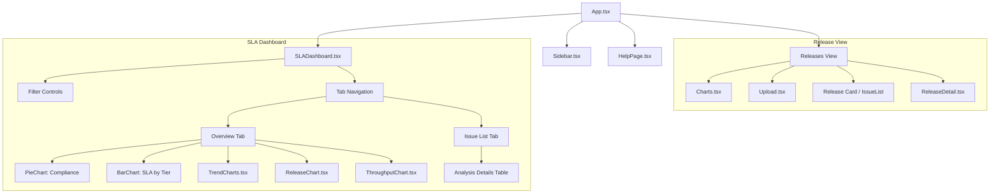
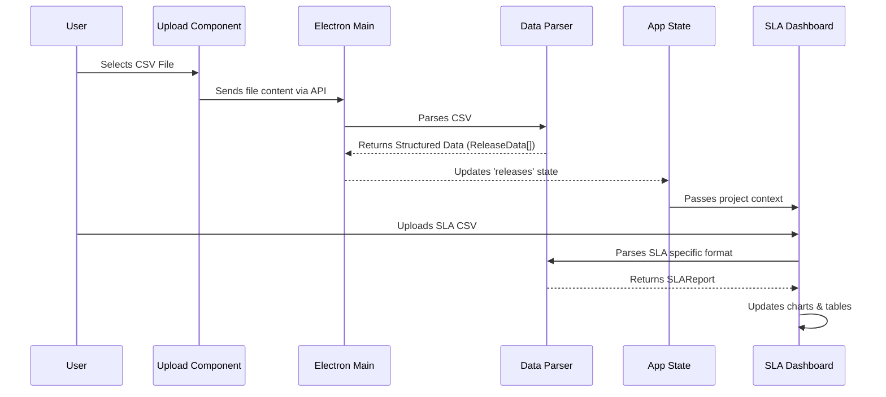

# Release Analyzer - Technical Documentation

## 1. Introduction
The **Release Analyzer** is an Electron-based desktop application designed to analyze Jira release data and SLA (Service Level Agreement) compliance. It allows users to import CSV exports from Jira, visualize release statistics (bugfixes vs evolutives), and track SLA performance for Reaction and Resolution times.

## 2. Technology Stack
-   **Core**: Electron (Main + Renderer processes)
-   **Frontend**: React, TypeScript, TailwindCSS
-   **Visualization**: Recharts
-   **Date Handling**: date-fns
-   **Build System**: Vite

## 3. Architecture Overview

### 3.1 Component Hierarchy
The application is structured around a main `App` component that manages routing between different views using state (`currentSection`).



### 3.2 Data Flow
Data flows from the CSV import to the parsed state and then to the specific dashboards.



## 4. Key Logic & Algorithms

### 4.1 SLA Calculation
The application calculates "Time to Reaction" and "Time to Resolution" based on Jira issue history.
-   **Reaction Time**: Duration from `Created` to `First Transition` (usually to "In Progress").
-   **Resolution Time**: Duration from `Created` to `Resolved`/`Closed`, excluding time spent in "Pause" statuses (e.g., "Waiting for Customer").
-   **Business Hours**: Calculations respect business hours (09:00 - 18:00) and exclude weekends.

### 4.2 Data Parsing
-   **Standard Releases**: Parsed from custom text/CSV format containing release notes.
-   **SLA Data**: Parsed from Jira CSV exports containing fields like:
    -   Key, Summary, Status, Priority
    -   Created, Updated, Resolved
    -   Time spent in specific statuses (for pause calculation)

## 5. Directory Structure
```
src/
├── main/                 # Electron Main Process
│   ├── index.ts          # Entry point
│   └── services/         # Node.js services (File I/O, Jira API)
├── preload/              # Context Bridge (Security)
└── renderer/             # React Frontend
    ├── src/
    │   ├── components/   # UI Components
    │   ├── assets/       # Images/Styles
    │   └── App.tsx       # Main Component
```

## 6. Interfaces

### 6.1 SLA Issue
Each analyzed issue in the SLA Dashboard follows this structure:
```typescript
interface SLAIssue {
    key: string;
    summary: string;
    priority: string;
    status: string;
    created: string; // ISO Date
    resolutionTime: number; // in milliseconds
    reactionTime: number; // in milliseconds
    timeInPause: number; // in milliseconds
    slaTier: 'Critical' | 'Major' | 'Minor' | 'Trivial';
    reactionSLAMet: boolean;
    resolutionSLAMet: boolean;
}
```
