# Logica di Calcolo SLA

Questo documento descrive la logica utilizzata dal sistema per il calcolo dei tempi di **Reaction** (Presa in carico) e **Resolution** (Sviluppo).

## Diagramma di Flusso Logico

```mermaid
flowchart TD
    subgraph "Anchors Temporal (Timeline)"
        A[<b>Created</b><br/>Data creazione Jira] -->|Default / Inizio| B(<b>tBacklog</b><br/>Entrata in Backlog)
        B -->|Evento: Transizione a 'Backlog'| C{<b>Reaction Time</b>}
        C -->|Evento: Da 'Backlog' a 'Presa in carico'| D(<b>tPresaInCarico</b>)
        D -->|Inizio Sviluppo| E{<b>Resolution Time</b>}
        E -->|Evento: Transizione a 'Done'| F(<b>tDone</b>)
    end

    subgraph "Calcolo Presa in Carico (Reaction)"
        C --- C1["Intervallo: [tBacklog -> tPresaInCarico]"]
    end

    subgraph "Calcolo Sviluppo (Resolution)"
        E --- E1["Intervallo Lordo: [tPresaInCarico -> tDone]"]
        E1 --> E2["Sottrazione Pause (Netto)"]
        E2 --- E3["Stati di Pausa:<br/>- Waiting for support<br/>- In pausa / Sospeso<br/>- Waiting for Support (II Level)"]
    end

    subgraph "Calendario e Orari"
        H{<b>Configurazione Oraria</b>}
        H -->|Expedite > 01/02/2026| H1[<b>24x7</b><br/>Tempo Solare continuo]
        H -->|Tutti gli altri casi| H2[<b>Business Hours</b><br/>LUN-VEN, 09:00-18:00]
        H2 --> H3[Esclusione Weekend e Festività Italiane]
    end

    C1 -.-> H
    E1 -.-> H
```

## Dettagli della Metodologia

### 1. Reaction Time (Presa in Carico)
Il tempo di reazione viene calcolato dal momento in cui l'attività entra formalmente nel **Backlog** fino a quando viene contrassegnata come **Presa in carico**.
- **Anchor Iniziale**: Transizione a 'Backlog' (o data creazione se l'attività nasce in Backlog).
- **Anchor Finale**: Transizione da 'Backlog' a 'Presa in carico'.

### 2. Resolution Time (Sviluppo)
Il tempo di risoluzione misura la durata dell'attività dal momento della **Presa in carico** fino alla chiusura definitiva (**Done**).
- **Calcolo Netto**: Dal tempo lordo vengono sottratti i periodi in cui l'attività si trova in uno stato di attesa o sospensione (SLA Paused).
- **Logica Multi-Segnale**: Il periodo di pausa è attivo se lo **Status** dell'issue è in pausa **OPPURE** se è presente una **Dipendenza Esterna**.
- **Stati di Pausa (Status)**:
    - `Waiting for support`
    - `Waiting for Support (II° Level)`
    - `In pausa`
    - `Sospeso`
    - `Pausa`
- **Dipendenze Esterne (Field)**:
    - `Dipendenza Adesso.it`
    - `Dipendenza GNV`
- **Fine Pausa Dipendenza**: Si esce dallo stato di pausa dipendenza quando il campo passa allo stato `(empty)`. È possibile rientrare in uno stato di dipendenza più volte durante il ciclo di vita dell'issue (il sistema calcola la somma di tutti i segmenti).

### 3. Calendario Lavorativo (Business Hours)
Salvo eccezioni, il tempo viene conteggiato solo durante le ore lavorative definite:
- **Orario**: 09:00 - 18:00
- **Giorni**: Lunedì - Venerdì
- **Esclusioni**: Weekend e Festività nazionali italiane (Capodanno, Epifania, Pasquetta, 25 Aprile, 1 Maggio, 2 Giugno, Ferragosto, Ognissanti, Immacolata, Natale, S. Stefano).

### 4. Eccezione Expedite (24x7)
Per le issue classificate come **Expedite** (o Priorità *Highest/Critical*) create a partire dal **1° Febbraio 2026**, il calcolo viene effettuato in modalità **24x7** (tempo solare continuo), ignorando le restrizioni del calendario lavorativo.

### 5. Supporto Service Request & CSV
Il calcolo del breakdown è esteso a tutte le modalità di caricamento:
- **Service Request (API)**: Per le SR che non seguono il flusso standard "Backlog -> Presa in carico", il sistema rileva automaticamente l'inizio dello sviluppo alla prima transizione verso uno stato operativo (*In Progress*, *Presa in carico*, etc.).
- **Dati da CSV**: Quando si carica un file CSV, il breakdown viene ricostruito aggregando i valori delle colonne corrispondenti agli stati di lavoro e pausa definiti.

### 6. Visualizzazione nel Dashboard
Il sistema fornisce una vista granulare del calcolo all'interno dell'accordion di ogni singola issue nella lista:
- **Resolution Breakdown**: Un elenco dettagliato che mostra il tempo trascorso in ogni specifica fase del ciclo di vita dell'issue (Open, Backlog, In Progress, Dipendenze, etc.) a partire dalla creazione o dall'inserimento in Backlog.
- **Changelog History**: Lo storico completo delle transizioni Jira utilizzate per ricostruire la timeline.
